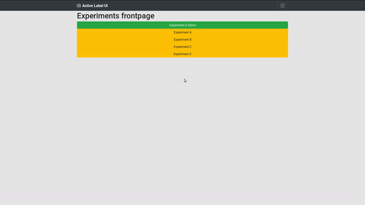

# Active Learning for Image Recognition using a Visualization-Based User Interface

## Description

This is the production version of the active learning approach A2VQ together with the web-based labeling interface. It uses no data set but loads images directly from a directory, extracts features of the images as described in the paper, builds an embedding for visualization and effective labeling. The labeled data can be saved class-wise, cleaned and exported together with the labels, images and calculated features.

If you are interested in the code used in our user study for handling participants and e.g. record all their input data, check out [this commit](https://github.com/limchr/A2VQ/tree/3ef8988b338398fa8f2b73692f25d3215728c919).

## Setup

To run the project you need python2 or python3. Additionally you need to install the following packages:

```
pip install flask configparser sklearn keras pandas dill tensorflow-gpu umap-learn
```


Last but not least clone A2VQ also in a directory within your PYTHONPATH:

```
git clone https://github.com/limchr/a2vq
```

## Run

For running A2VQ several interfaces are possible. Default is the hard drive interface that loads everything from disk and also calculates features for a selected images directory. To setup the respective paths, go to settings.py and change the paths to a directory containing images. Those images have to be JPEGS with the filename extension .jpg. Also a directory has to be defined that is used for storing dump files like extracted features, the thumbnails or labels.

To start the interface web page, run main.py with python:

```
python3 main.py
```

This is starting flask within a debugging server on localhost on port 5000.

To initialize the harddrive interface (feature extraction, dump file creations) open your favorite webbrowser with this url:

```
firefox http://localhost:5000/setup
```

Now open the main page with http://localhost:5000/
You should see an embedding view with all images from your defined image path. You can navigate to other embedding views within the menu (click on the upper right button to view all pages). Also you can export the labeled data and clean it up automatically.


## Usage


The following gif is showing the user interface while labeling MNIST. However, preliminary experiments showed that the t-SNE visualization is much better when using image features from a state of the art CNN. In the MNIST examples are some outlier because t-SNE is trained directly on pixel values. 



## Modifications

To change the approach for creating the embedding, change EMBEDDING_FUN in settings.py to another callback.

To change the feature extraction, edit feature_extraction.py

To change the trained classifier from GLVQ to something else, edit the respective functions within db_file_interface.py


## Used Software

The web-based Interface makes use of [JQuery](https://jquery.org/) and [Bootstrap](https://getbootstrap.com/) which is both licenced under MIT license. 

## Reference

If you find our work usefull in any way, please consider citing us:

[Limberg, C., Krieger, K., Wersing, H., & Ritter, H. (2019, September). <br>Active Learning for Image Recognition Using a Visualization-Based User Interface. <br>In International Conference on Artificial Neural Networks (pp. 495-506). Springer, Cham.](https://pub.uni-bielefeld.de/download/2939051/2939052/icann2019_submitted.pdf)

## License
Copyright (C) 2019<br>
Christian Limberg<br>
Centre of Excellence Cognitive Interaction Technology (CITEC)<br>
Bielefeld University<br><br>

Redistribution and use in source and binary forms, with or without modification,
are permitted provided that the following conditions are met:

1. Redistributions of source code must retain the above copyright notice,
this list of conditions and the following disclaimer.

2. Redistributions in binary form must reproduce the above copyright notice, this list of conditions
and the following disclaimer in the documentation and/or other materials provided with the distribution.

3. Neither the name of the copyright holder nor the names of its contributors may be used to endorse or promote
products derived from this software without specific prior written permission.

THIS SOFTWARE IS PROVIDED BY THE COPYRIGHT HOLDERS AND CONTRIBUTORS "AS IS" AND ANY EXPRESS OR IMPLIED WARRANTIES, INCLUDING, BUT NOT LIMITED TO, THE IMPLIED WARRANTIES OF MERCHANTABILITY AND FITNESS FOR A PARTICULAR PURPOSE ARE DISCLAIMED. IN NO EVENT SHALL THE COPYRIGHT HOLDER OR CONTRIBUTORS BE LIABLE FOR ANY DIRECT, INDIRECT, INCIDENTAL, SPECIAL, EXEMPLARY, OR CONSEQUENTIAL DAMAGES (INCLUDING, BUT NOT LIMITED TO, PROCUREMENT OF SUBSTITUTE GOODS OR SERVICES; LOSS OF USE, DATA, OR PROFITS; OR BUSINESS INTERRUPTION) HOWEVER CAUSED AND ON ANY THEORY OF LIABILITY, WHETHER IN CONTRACT, STRICT LIABILITY, OR TORT (INCLUDING NEGLIGENCE OR OTHERWISE) ARISING IN ANY WAY OUT OF THE USE OF THIS SOFTWARE, EVEN IF ADVISED OF THE POSSIBILITY OF SUCH DAMAGE.
